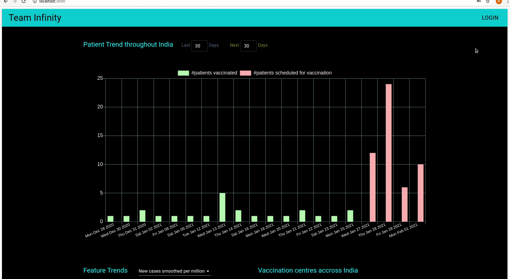

# Code Repository for EY Techathon

## Working Demo

1. Home page with all the stats and trends.

   

2. User(patient) signing up and registering for the vaccination.

   

3. Super user (vaccination production center) dispatches a new batch of vaccines

   

4. Admin (vaccination center) schedules time slots for those patients who have be prioritized by the super user and dispatched vaccines.

   

## Contributing Guidelines

1. This repository consists of 3 sub projects (folders) namely `web`, `server` and `model`.
2. So, commit code to the corresponding folders.

## Dev Setup

### Setting up the repository locally

1. Fork the repo to your account.

2. Go to the forked repo and clone it to your local machine:

```
git clone https://github.com/<your_username>/ey-techathon.git
```

This will make a copy of the code to your local machine.

3. Now move to the `ey-techathon` directory.

```
cd ey-techathon
```

4. Now check the remote of your local code by:

```
git remote -v
```

The response should look like:

```
origin	https://github.com/<username>/ey-techathon.git (fetch)
origin	https://github.com/<username>/ey-techathon.git (push)
```

To add upstream to remote, run:

```
git remote add upstream https://github.com/NBNARADHYA/ey-techathon.git
```

Again run `git remote -v`, the response should look like:

```
origin	https://github.com/<username>/ey-techathon.git (fetch)
origin	https://github.com/<username>/ey-techathon.git (push)
upstream	https://github.com/NBNARADHYA/ey-techathon (fetch)
upstream	https://github.com/NBNARADHYA/ey-techathon (push)
```

### Setup `server`

#### Pre-requisites

1. Install `postgresql` by looking up the following docs ([debian based linux](https://www.postgresql.org/download/linux/debian/), [mac os](https://www.postgresql.org/download/macosx/) and [windows](https://www.postgresql.org/download/windows/))
2. Create a new user by running `createuser -U postgres -P techathon `
3. Create a new database by running `createdb -U postgres -O techathon techathon`

#### Steps

1. Run `cd server`
2. Setup environmental variables according to `.example.env`
3. Run `yarn install`
4. Run `yarn run dev` to start the server

### Setup `web`

#### Steps

1. Run `cd web`
2. Setup environmental variables according to `.example.env`
3. Run `yarn install`
4. Run `yarn start` to start the server

### Setup `model`

#### Pre-requisites

1. Install `python3` on your device if not already by looking up the following docs([windows](https://www.python.org/downloads/windows/), [mac](https://www.python.org/downloads/mac-osx/), `ubuntu` comes pre-installed)
2. Install `virtualenv` if not already by running `pip3 install virtualenv`

#### Steps

1. Run `cd model`
2. Run `python3 -m venv venv` to create a virtual environment
3. Activate `venv` by running `. venv/bin/activate`
4. Run `pip3 install -r requirements.txt` to install packages
5. Run `FLASK_APP=app.py flask run -h localhost -p 8000` to start the server
